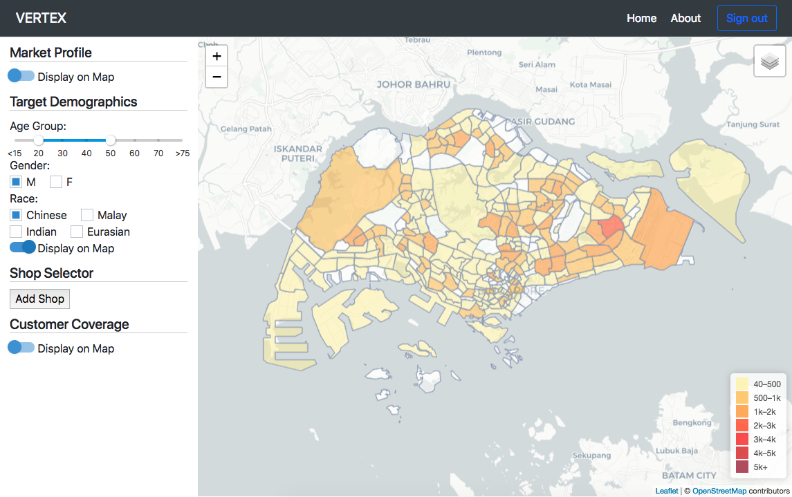
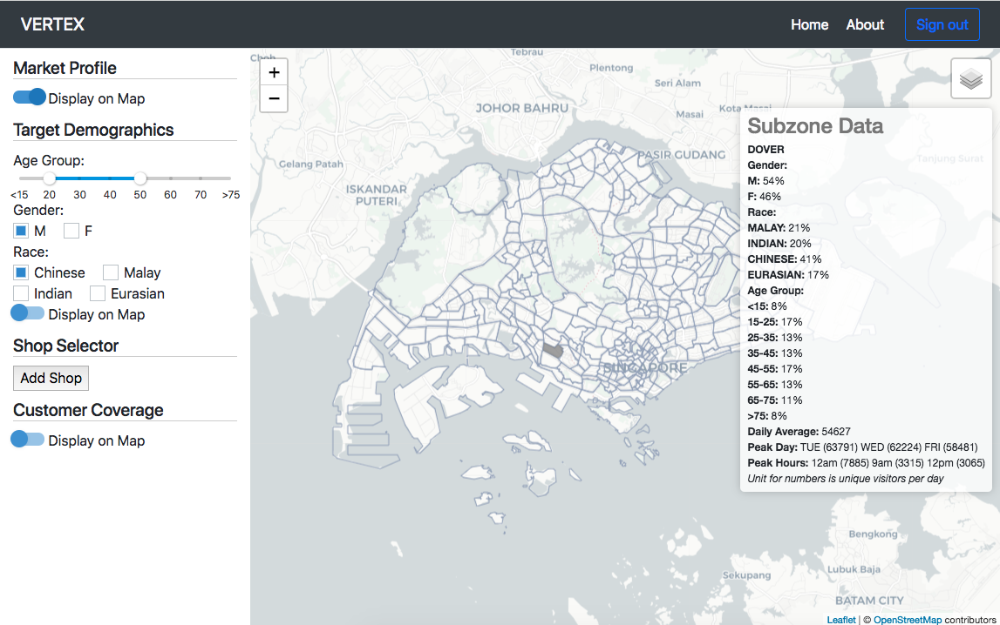

# Vertex

> A Vue.js visualization and management tool for retailers to categorize their customers into demographic groups. 

## Installing

``` bash
# install dependencies
npm install / yarn install

# serve with hot reload at localhost:8080
npm run dev / yarn run dev
```

## Features

- Target Demographic Heat Map

Permits the use of filters for demographics e.g. gender, race, age range.



- Market Profile per SubZones

Provides summary statistics of each subzone including demographics, peak periods and days.



- Customer Coverage Map

Displays an eagle's eye view of shop / franchise locations 

## Built With

- Vue.js - Web Application
- Leaflet.js - Interactive Map
- [Data.gov.sg](https://data.gov.sg/dataset/master-plan-2014-subzone-boundary-web?resource_id=1f7498f8-0132-4e74-81b2-3fe3199afecf) - Master Plan 2014 Subzone Boundary
- [DataSpark](https://www.datasparkanalytics.com/) Stay Point API and Origin Destination Matrix API

## Authors

- Tay Yu Jia
- Foo Guo Wei
- John Phua
- Adam Chew

## License

This project is licensed under the MIT License - see the [LICENSE](LICENSE) file for details
